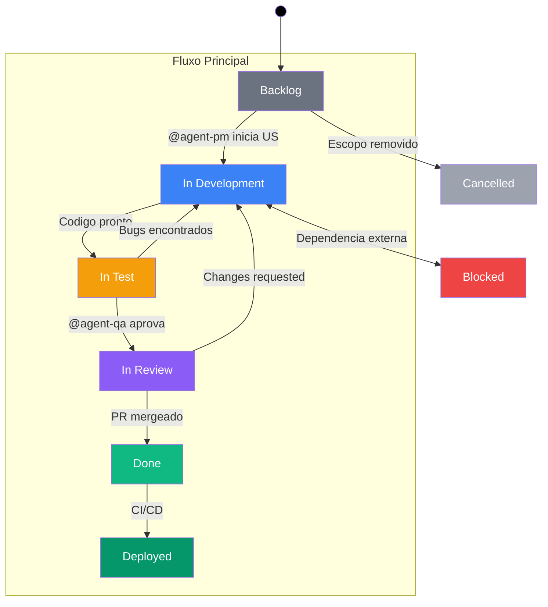

# Workflow de Desenvolvimento — Atrides Comms

## Visão Geral

O desenvolvimento do Atrides Comms segue um workflow baseado em User Stories (US) gerenciadas no ClickUp, com 3 agents do Claude Code que automatizam planejamento, revisão de código e testes.

## Diagrama de Status



## Estágios

| Status | Descrição | Critério de Entrada | Critério de Saída |
|--------|-----------|--------------------|--------------------|
| `backlog` | Não iniciado | US criada pelo PM | Desenvolvedor inicia trabalho |
| `in development` | Desenvolvimento ativo | US priorizada | Código pronto para testes |
| `in test` | Em testes/QA | Código pronto | QA aprova todos os critérios de aceite |
| `in review` | Aguardando review/merge | Testes aprovados, PR aberto | PR mergeado na main |
| `blocked` | Bloqueado | Dependência externa identificada | Dependência resolvida |
| `done` | Concluído | PR mergeado | N/A |
| `deployed` | Em produção | CI/CD executado | N/A |
| `cancelled` | Cancelado | Escopo removido | N/A |

## Agents

### PM Agent (`@agent-pm`)

**Papel:** Product Manager — planeja, prioriza e cria tasks no ClickUp.

**Quando usar:**
- Planejar novas features ou triagem de bugs
- Quebrar ideias em tasks parallelizáveis
- Priorizar backlog por impacto e esforço
- Mover tasks entre status no ClickUp

**Como invocar:**
```
@agent-pm quero adicionar autenticação ao app
@agent-pm o que devemos trabalhar agora?
@agent-pm mova a US0000005 para in review
```

**Capacidades:**
- Criar US com subtasks no ClickUp (numeração automática)
- Scoring por Impact × Effort
- Gestão de status (8 status válidos)
- Finalizar subtasks e atualizar progresso
- Salvar planos em `docs/plans/`

### Code-Review Agent (`@agent-code-review`)

**Papel:** Revisor de código — valida implementação contra critérios de aceite.

**Quando usar:**
- Após implementar uma feature, antes do merge
- Para verificar se critérios de aceite foram atendidos
- Para mover tasks para `in review`

**Como invocar:**
```
@agent-code-review revise a US0000009
@agent-code-review as subtasks de US0000015 estão prontas para review
```

**Capacidades:**
- Rastrear fluxo completo de dados pela arquitetura
- Comparar implementação com critérios de aceite (✅/⚠️/❌)
- Comentar resultados no ClickUp
- Mover tasks para `in review` (aprovado) ou manter em `in development` (changes requested)

### QA Agent (`@agent-qa`)

**Papel:** Testador — executa testes visuais e funcionais, gera evidências.

**Quando usar:**
- Após code review aprovado
- Para gerar evidências visuais (screenshots)
- Para validar UI em desktop e mobile
- Para testar dark/light mode

**Como invocar:**
```
@agent-qa teste a US0000009 e gere evidências
@agent-qa verifique o layout do sidebar em desktop e mobile
```

**Capacidades:**
- Testes via Playwright MCP (navegação, cliques, formulários)
- Screenshots em múltiplos viewports (desktop 1400x900, mobile 375x812)
- Upload de evidências no ClickUp
- Relatório estruturado de resultados (pass/fail por critério)
- Se aprovado: mover task para `in review` (pronto para PR)
- Se reprovado: mover task para `in development` (volta para correção)

## Ciclo de Vida de uma US

### Exemplo passo a passo

1. **Planejamento** — Usuário descreve a feature
   ```
   @agent-pm quero redesign do layout com sidebar e paleta teal
   ```
   - PM analisa codebase, cria US + subtasks no ClickUp
   - Define waves de execução (parallelizáveis vs sequenciais)
   - Status: `backlog`

2. **Desenvolvimento** — Usuário (ou Claude) implementa as subtasks
   - PM move US para `in development`
   - Subtasks da Wave 1 vão para `in development`
   - Ao concluir cada subtask, mover para `done`
   - Status: `in development`

3. **Testes (QA)** — Código pronto
   ```
   @agent-qa teste a US0000009
   ```
   - Executa testes visuais (desktop, mobile, dark, light)
   - Captura screenshots como evidência
   - Anexa evidências no ClickUp
   - Se aprovado: move para `in review`
   - Se bugs encontrados: **volta para `in development`**, reporta os bugs, desenvolvedor corrige, e QA re-testa
   - **Nunca abrir PR com testes falhando**
   - Status: `in test` → `in review` (ou volta para `in development`)

4. **Code Review & PR** — Testes aprovados
   ```
   @agent-code-review revise a US0000009
   ```
   - Abre PR na branch
   - Valida cada critério de aceite contra o código
   - Comenta resultados no ClickUp
   - Se aprovado: merge e move para `done`
   - Se changes requested: volta para `in development`
   - Status: `in review` → `done`

5. **Deploy** — PR mergeado
   - CI/CD faz deploy (quando configurado)
   - Task vai para `deployed`

## Convenções

### Nomenclatura de Tasks
- **US Parent:** `[USXXXXXXX] - Título descritivo` (7 dígitos, incremental)
- **Subtasks:** `[Fase N] Título descritivo` (numeração sequencial)
- **Tags:** `pm-agent`, `wave-1`, `wave-2`, `S`, `M`, `L`

### Prioridade
| Score (Impact × Effort) | Prioridade ClickUp |
|-------------------------|-------------------|
| 20-25 | Urgent |
| 15-19 | High |
| 10-14 | Normal |
| 5-9 | Low |

### Branches
- Pattern: `feat/CLICKUP_ID-slug-descritivo`
- Exemplo: `feat/86aghxvba-redesign-layout-ui`
- Base: sempre `main`
